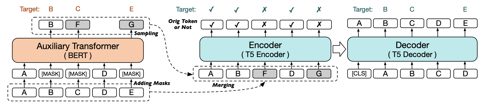
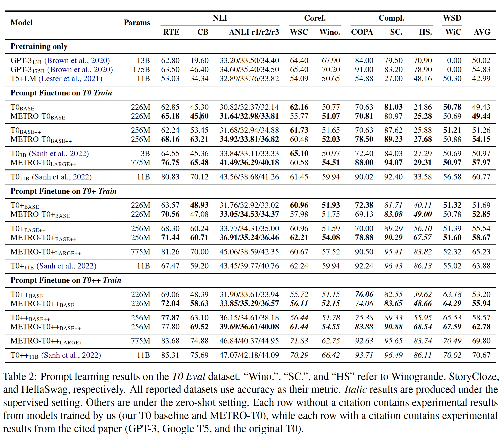

# METRO-T0

Welcome to the repository for METRO-T0, where you'll find model checkpoints, our pretraining pipeline, and the prompt-finetuning pipeline.

Paper: [Model-Generated Pretraining Signals Improves Zero-Shot Generalization of Text-to-Text Transformers](https://arxiv.org/abs/2305.12567) (ACL 2023)

Authors: [Linyuan Gong](https://github.com/gonglinyuan), Chenyan Xiong, Xiaodong Liu, Payal Bajaj, Yiqing Xie, Alvin Cheung, Jianfeng Gao, Xia Song

Video Presentation: https://www.youtube.com/watch?v=XdejDJwuUls

METRO-T0 is a T5-style text-to-text Transformer pretrained using model-generated pretraining signals, prompt-finetuned on a family of public NLP tasks proposed in [T0](https://arxiv.org/abs/2110.08207).
METRO-T0 is highly parameter efficient. For example, METRO-T0-Large++ (775M parameters) outperforms GPT-3 (175B parameters) and T0-3B (3B parameters) on a wide range of NLP tasks.




## Use METRO-T0 Models

We've uploaded all METRO-T0 models referenced in our paper to the Huggingface Model Hub for your convenience.
To use our METRO-T0++-Large++ model in PyTorch (Python 3.7+, PyTorch 1.12+ and transformers 4.17+ are prerequisites), refer to the code snippet below:

```python
from transformers import AutoModelForSeq2SeqLM, AutoTokenizer

model = AutoModelForSeq2SeqLM.from_pretrained("gonglinyuan/metro_t0pp_largepp", trust_remote_code=True)
tokenizer = AutoTokenizer.from_pretrained("gonglinyuan/metro_t0pp_largepp", trust_remote_code=True)

input_text = "Is this review positive or negative? Review: this is the best cast iron skillet you will ever buy"
inputs = tokenizer([input_text], max_length=512, truncation=True, add_special_tokens=True, return_tensors="pt").input_ids
outputs = model.generate(inputs, max_new_tokens=256, do_sample=False)

print(tokenizer.decode(outputs[0], skip_special_tokens=True))  # expected: positive
```

Here is the list of available models:

- [https://huggingface.co/gonglinyuan/metro_t0_base](https://huggingface.co/gonglinyuan/metro_t0_base)
- [https://huggingface.co/gonglinyuan/metro_t0p_base](https://huggingface.co/gonglinyuan/metro_t0p_base)
- [https://huggingface.co/gonglinyuan/metro_t0pp_base](https://huggingface.co/gonglinyuan/metro_t0pp_base)
- [https://huggingface.co/gonglinyuan/metro_t0_basepp](https://huggingface.co/gonglinyuan/metro_t0_basepp)
- [https://huggingface.co/gonglinyuan/metro_t0p_basepp](https://huggingface.co/gonglinyuan/metro_t0p_basepp)
- [https://huggingface.co/gonglinyuan/metro_t0pp_basepp](https://huggingface.co/gonglinyuan/metro_t0pp_basepp)
- [https://huggingface.co/gonglinyuan/metro_t0_largepp](https://huggingface.co/gonglinyuan/metro_t0_largepp)
- [https://huggingface.co/gonglinyuan/metro_t0p_largepp](https://huggingface.co/gonglinyuan/metro_t0p_largepp)
- [https://huggingface.co/gonglinyuan/metro_t0pp_largepp](https://huggingface.co/gonglinyuan/metro_t0pp_largepp)

## Experiment Results



## Reproduce Our Experiment Results

We use [t-zero](https://github.com/bigscience-workshop/t-zero) for evaluating our models on the _T0 Eval_ benchmark.
The `t-zero` codebase has been shipped with this repository. Some changes are made so that METRO-T0 models are supported.
Given the highly specific version requirements of the `t-zero` codebase dependencies, it's advisable to create a fresh conda environment (or virtualenv) for evaluation purposes. You can do this by following the steps below:

```bash
conda create -n t0 python=3.7
conda activate t0
python -m pip install \
    torch==1.12.0+cu113 torchvision==0.13.0+cu113 \
    torchaudio==0.12.0+cu113 \
    --extra-index-url https://download.pytorch.org/whl/cu113
python -m pip install -e ./t-zero
```

To evaluate METRO-T0-Base:

```bash
cd t-zero/evaluation
python run_all_multi.py \
    gonglinyuan/metro_t0_base \
    /path/to/result_save_dir/metro_t0pp_base \
    --n_gpus 8  # assume 8 GPUs
```

Expected output:

```
super_glue rte 61.6245487364621
super_glue cb 52.73809523809525
anli dev_r1 31.706666666666667
anli dev_r2 33.486666666666665
anli dev_r3 33.44444444444444
super_glue wsc.fixed 58.75
winogrande winogrande_xl 50.95501183898973
super_glue copa 66.25
story_cloze 2016 82.40513094601816
hellaswag None 25.647281418044216
super_glue wic 50.423197492163006
Overall Acc: 49.76645849523184
```

To evaluate METRO-T0++-Large++:

```bash
cd t-zero/evaluation
python run_all_multi.py \
    gonglinyuan/metro_t0pp_largepp \
    /path/to/result_save_dir/metro_t0pp_base \
    --n_gpus 8  # assume 8 GPUs
```

Expected output:

```
super_glue rte 83.68231046931406
super_glue cb 74.8809523809524
anli dev_r1 46.84
anli dev_r2 40.373333333333335
anli dev_r3 44.949999999999996
super_glue wsc.fixed 71.82692307692307
winogrande winogrande_xl 62.74664561957379
super_glue copa 92.625
story_cloze 2016 95.64938535542491
hellaswag None 83.74327823142801
super_glue wic 70.4858934169279
Overall Acc: 69.80033835307977
```

## Pretraining

We use [fairseq](https://github.com/facebookresearch/fairseq) for pretraining and prompt-finetuning our models. Our extended version of the `fairseq` codebase has been shipped with this repository to support T5 pretraining and METRO-style pretraining.


```bash
export CUDA_VISIBLE_DEVICES=0,1,2,3,4,5,6,7
fairseq-hydra-train -m --config-dir examples/t5/config/pretraining \
--config-name t5_base_8gpus \
common.user_dir=$(pwd)/efficent_large_lm_trainer \
task.data=/path/to/wikibook_data \
hydra.sweep.dir=/path/to/outputs
```

## Prompt-Finetuning

TODO

## Open-Source Licenses

Please refer to the `LICENSE` file in each subdirectory.

## Citation

If you find the code and models useful for your research, please cite the following paper:

```
@misc{gong2023modelgenerated,
      title={Model-Generated Pretraining Signals Improves Zero-Shot Generalization of Text-to-Text Transformers}, 
      author={Linyuan Gong and Chenyan Xiong and Xiaodong Liu and Payal Bajaj and Yiqing Xie and Alvin Cheung and Jianfeng Gao and Xia Song},
      year={2023},
      eprint={2305.12567},
      archivePrefix={arXiv},
      primaryClass={cs.CL},
      url={https://arxiv.org/abs/2305.12567}
}
```
